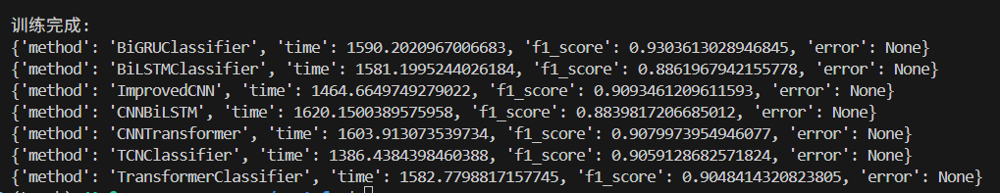

# 12.22

## 17分割调整

方向调整

## 机器学习

### 标记区域

每个数据的标记是[0, 0, 1, 0 ... 0]
区域内缺血含量大于0.2判断区域缺血

### 生成新数据（包含健康数据集）

### 标记网络结构

机器学习方面能用的模型不多（17个二分类模型）
深度学习方面和正常分类网络区别不大

### 评价指标

- hamming loss
- precision(误报) / recall(漏报) / f1-score（precision recall 调和平均）

#### 机器学习方法

- knn
- linear svm
- logistic regression
- random forest

#### 深度学习方法

- BiGRUClassifier
- BiLSTMClassifier
- ImprovedCNN
- TCNClassifier
- TransformerClassifier

多个case一起训练测试，包含健康，严重与不严重数据集

