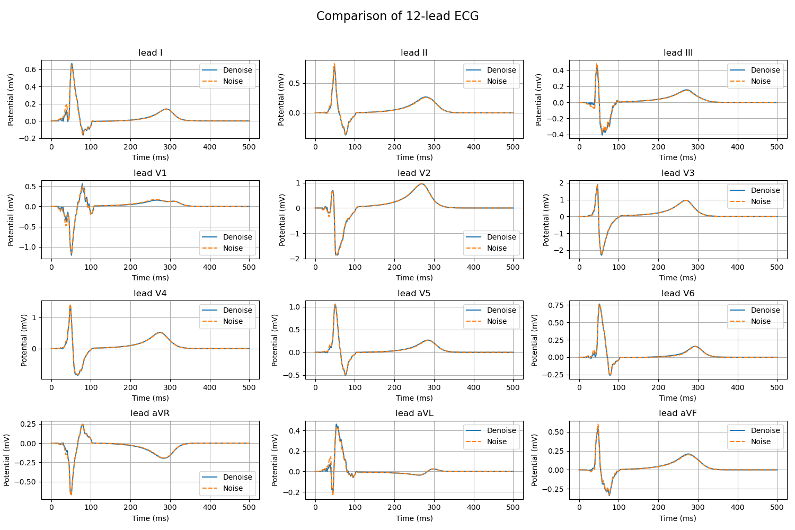

# 12.29

## 健康数据集构造

### 激活时刻加噪声

### 圆心半径

可能存在出现缺血，但由于占比都未达到阈值，会被标记为未缺血
观察部分数据的心电图，与正常相差不大

（保留/不保留）

## 数据统计

总条数 9426

case1 4108
case2 5318

case1_healthy 100
case1_mild 1740
case1_severe 2268

case2_healthy 100
case2_mild 2318
case2_severe 2900

## 标签分布情况

单标签数据量
多标签数据量
17类数据分布情况
单一类别分布情况

## 指标

见文档

## 数据降维

空间降维 时间降维

## 实验结果

模型参数的存储
作图函数
错误数据的对比

## 网格数据

基本数据已提取(点的坐标, 四面体网格的构成)
共分为24个区域

缺少导联位置
