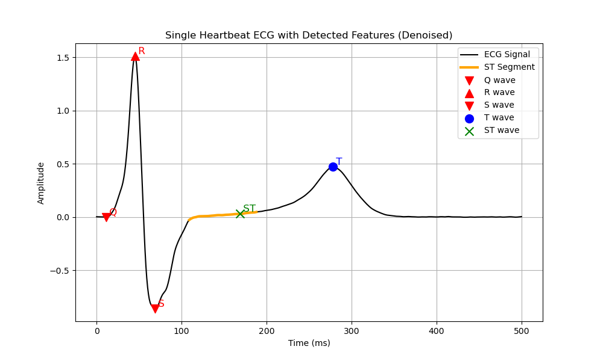
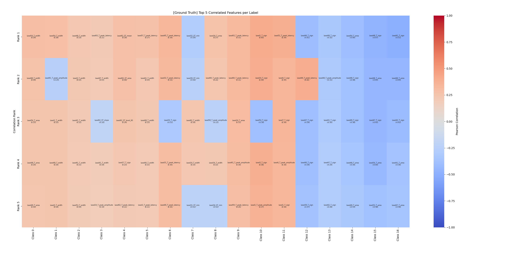
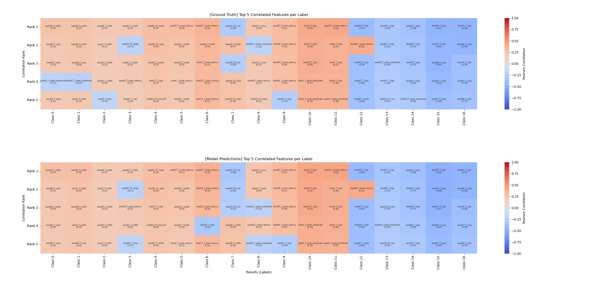

# 1.19

数据集评价方法

- L(S): number of class labels
- LCard(S): the average number of relevant labels per example
- LDen(S): LCard(S) / L(S)
- DL(S): distinct label sets which measures the number of distinct relevant label set
- PDL(S): proportion of distinct label sets which normalizes distinct label sets by the number of examples
- ImR_j: |D_j^-| / | D_j^+| Imbalance Ratio

评价标准

- Hamming Loss
- Macro-F1
- Macro-AUC
- RL Ranking Loss
- AP Average Precision

## 严重非严重

缺血整体占比

| max ratio | Severe | Mild |
| :--- | :--- | :--- |
| **normal_male** | 0.3632 | 0.1032 |
| **normal_male2** | 0.2940 | 0.0808 |

| min ratio | Severe | Mild |
| :--- | :--- | :--- |
| **normal_male** | 0.0294 | 0.0067 |
| **normal_male2** | 0.0217 | 0.0074 |

## 特征提取

1. MIT-BIH 配套 wfdb 工具
基本没法用，针对 MIT-BIH 数据，无法提取ST段特征

2. neurokit2工具包 有问题

- 无法处理单次心拍
- 如果重复多次心拍，得到的结果差 有比较多的nan

3. 自己写代码判断

64导有可能不是QRS波形式(ECG给的转移矩阵不知道怎么获得)

单导 + 多导 混合输入

### 数据集热力图

64导 64n

### 输入是64  n

| method | macro f1-score | micro f1-score | hamming loss | accuracy |
| --- | --- | --- | --- | --- |
| knn | 0.8466 | 0.8509 | 0.0521 | 0.4791 |
| lgb | 0.8966 | 0.8980 | 0.0358 | 0.5483 |
| xgb | 0.9386 | 0.9395 | 0.0219 | 0.6826 |
| random forest | 0.9164 | 0.9182 | 0.0287 | 0.6321 |
| logistic regression | 0.7445 | 0.7497 | 0.1069 | 0.1750 |

### 输入是64  n + 2  n (统计特征)

| method | macro f1-score | micro f1-score | hamming loss | accuracy |
| --- | --- | --- | --- | --- |
| knn | 0.8463 | 0.8508 | 0.0521 | 0.4786 |
| lgb | 0.8963 | 0.8971 | 0.0361 | 0.5537 |
| xgb | 0.9373 | 0.9383 | 0.0223 | 0.6831 |
| random forest | 0.9160 | 0.9180 | 0.0288 | 0.6336 |
| logistic regression | 0.7765 | 0.7806 | 0.0915 | 0.2138 |

## 模型选择

### 基选择器的选择方法

单个类别二分类

- knn
- lgb
- xgb
- random forest
- logistic regression

### 标签相关性模型

根据周志华的文章，多标签分类算法可分为3类

- first-order strategy
  无视标签间的相关性
  - Binary Relevance 0.92
  - ML-KNN 0.85
  - Decision Tree 0.82

- second-order strategy
  考虑标签两两之间的关系
  - Calibrated Label Ranking 0.91

- high-order strategy
  考虑所有标签间的关系
  - Classifier Chain 0.92
  - Random k-Labelsets 0.78
  - Collective Multi-Label Classifier 0.92

- Label Powerset 0.92

### 深度学习

基础模型结果较机器学习模型差一点 0.87
